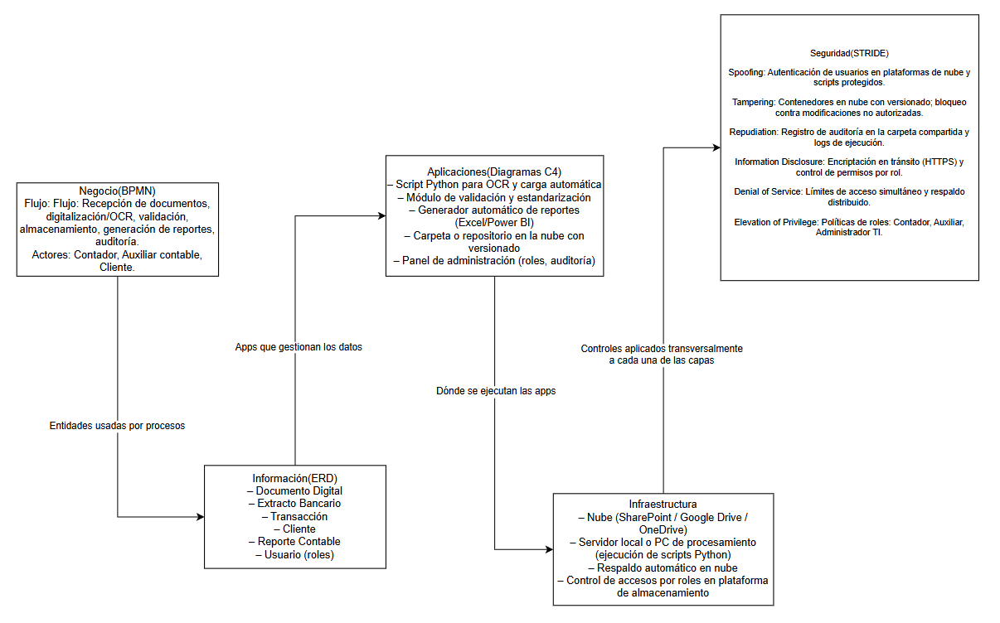

# Informe Técnico del Taller
---
## Nombre del Taller

Taller 7 - Integración de Vistas

---
## Intergantes del equipo

- Julián David Alvarado Gantiva
- Julián Camilo Durán Valencia
- Sebastián Piñeros Castellanos
---

## Descripción general del trabajo

El objetivo del taller fue integrar, en una única arquitectura coherente, los diferentes artefactos desarrollados durante el proyecto para el cliente real: una empresa del sector contable que actualmente opera procesos manuales, con almacenamiento disperso y sin controles de seguridad ni trazabilidad. La actividad buscó articular las vistas de negocio, información, aplicaciones, infraestructura y seguridad, reconstruyendo cómo dichas capas se relacionan entre sí y soportan el modelo TO-BE propuesto.

Durante la clase se tomó como referencia el caso FarmApp para comprender el flujo de integración entre vistas. Posteriormente, el equipo replicó la estructura con el proyecto real, sintetizando los entregables previos y organizándolos dentro de un diagrama maestro de arquitectura. El resultado es una visión completa que permite entender cómo interactúan los procesos, los datos y las soluciones tecnológicas dentro de la propuesta de modernización.

---
## Proceso de desarrollo

Para construir la integración final, el equipo inició revisando los artefactos existentes: el diagnóstico AS-IS, el proceso TO-BE, el modelo de datos unificado, la propuesta de automatización (C1), la centralización en la nube (C2) y los controles de seguridad sugeridos.

Las decisiones clave fueron:

- Estructurar primero la capa de negocio, representando el flujo TO-BE que reemplaza la digitación manual por OCR, validación automática y reportes generados automáticamente.

- Modelar después la capa de información, identificando entidades relevantes como Extracto, Documento, Registro Contable y Usuario, que se manipulan a lo largo del proceso.

- Definir la capa de aplicación, donde se distribuyen los módulos tecnológicos propuestos: script OCR en Python, módulo de validación de datos, generador automático de reportes y herramientas de almacenamiento en la nube.

- Mapear la infraestructura, contemplando nube híbrida (SharePoint o Google Drive), servidores locales existentes y servicios de sincronización.

- Cruzar el modelo con controles STRIDE, para garantizar seguridad, trazabilidad y continuidad.

Las herramientas utilizadas incluyeron diagramas BPMN (para procesos), esquemas ERD, representaciones UML y diagramas de integración elaborados en Draw.io. El modelo fue iterado varias veces para asegurar trazabilidad entre capas.

---
##  Análisis del modelo propuesto

### 3.1 Estructura del modelo

El modelo final se organiza en cinco capas:

1. Negocio: describe el flujo TO-BE digitalizado desde la recepción de documentos hasta la generación automática de reportes.

2. Información: contiene las entidades base que soportan los procesos: Extracto, Documento, Registro, Validación, Reporte y Usuario.

3. Aplicaciones: incluye los componentes tecnológicos que gestionan los datos: OCR + Python, módulo validador, motor de reportes, consola de administración y repositorio en nube.

4. Infraestructura: define dónde se despliegan las aplicaciones (SharePoint / Google Drive, servidor local, backups).

5. Seguridad: aborda amenazas STRIDE y controles como autenticación, versiones, auditoría y cifrado.

### 3.2 Representación de necesidades del cliente

El modelo responde directamente a los problemas de la empresa contable:

- Reduce la digitación manual (OCR + validaciones).

- Evita pérdidas de información mediante nube y versionado.

- Aumenta trazabilidad con auditorías.

- Mejora eficiencia y escalabilidad gracias a reportes automáticos.

Cada capa del modelo refleja un reto identificado en el diagnóstico inicial.

### 3.3 Supuestos tomados

- El cliente puede adoptar almacenamiento en la nube como SharePoint o Google Drive.

- Los empleados cuentan con conocimientos básicos para usar herramientas digitales.

- Los documentos de entrada tienen un formato lo suficientemente regular para ser procesados por OCR.

- La empresa está dispuesta a implementar control de accesos y gestión de usuarios.

---
## Diagrama final entregado

El diagrama integra las cinco vistas para mostrar cómo las aplicaciones propuestas ejecutan el flujo TO-BE, consumen las entidades definidas en la capa de información, se alojan en una infraestructura híbrida y se protegen mediante controles STRIDE.

---
## Tabla de actores, entidades o componentes

| Nombre del elemento             | Tipo             | Descripción                                                                                 | Responsable        |
|---------------------------------|------------------|---------------------------------------------------------------------------------------------|--------------------|
| Cliente (empresa contable)      | Actor            | Usuario que recibe los servicios de automatización, reportes y centralización de datos.     | Equipo del proyecto |
| Auxiliar contable               | Actor            | Persona que interactúa con el sistema para cargar documentos, revisar reportes y validar.   | Cliente             |
| Script OCR en Python            | Componente       | Automatiza la digitalización y lectura de extractos y documentos.                           | Equipo técnico      |
| Módulo de validación            | Componente       | Verifica formato, estructura y calidad de datos antes de su carga.                          | Equipo técnico      |
| Carpeta nube (SharePoint/Drive) | Componente       | Repositorio centralizado con control de versiones y accesos.                                | Cliente             |
| Base de datos unificada (Excel) | Entidad          | Archivo estructurado que consolida la información contable normalizada.                     | Equipo técnico      |
| Reporte automático (Power BI/Excel) | Componente   | Genera reportes consolidados de forma automática según las reglas del negocio.              | Equipo técnico      |
| Sistema de control de accesos   | Componente       | Define permisos por rol y protege la información contra accesos no autorizados.             | Cliente             |
| Auditoría de cambios            | Funcionalidad    | Registra acciones de los usuarios, modificaciones y eventos críticos del sistema.           | Cliente             |
| Respaldo automático             | Funcionalidad    | Genera copias de seguridad periódicas de la información y archivos.                         | Cliente             |
| Documentos contables digitalizados | Entidad       | Archivos extraídos mediante OCR o cargados como PDF/imagen para su procesamiento.           | Auxiliar contable   |

---
## Investigación complementaria

### Tema investigado:

Buenas prácticas para integración arquitectónica y uso del modelo STRIDE en sistemas contables.

### Resumen:

Durante la investigación se revisaron lineamientos de arquitectura empresarial, especialmente del marco TOGAF, que propone dividir los sistemas en capas de negocio, datos, aplicaciones y tecnología. Esta referencia permitió estructurar el diagrama final de forma coherente, facilitando la trazabilidad entre vistas. De acuerdo con The Open Group (2018), la arquitectura empresarial debe garantizar consistencia y alineación estratégica, lo cual fue aplicado al integrar las soluciones de automatización y digitalización del proceso contable.

También se profundizó en el modelo STRIDE, un framework de análisis de amenazas creado por Microsoft para identificar riesgos de seguridad en sistemas de información. Según Shostack (2014), STRIDE permite clasificar vulnerabilidades como suplantación, manipulación de datos y exposición de información, orientando la selección de controles adecuados. Su aplicación en el proyecto ayudó a reforzar la capa de seguridad, especialmente en temas de acceso, auditoría y cifrado al manejar datos sensibles de documentos financieros.

Estas buenas prácticas justifican la estructura adoptada y garantizan que la arquitectura propuesta sea segura, escalable y alineada con las necesidades del cliente.

---

## Referencias

- Microsoft. (2023). Secure development lifecycle (SDL). STRIDE threat model. Microsoft Docs.
- Shostack, A. (2014). Threat Modeling: Designing for Security. Wiley.
- The Open Group. (2018). TOGAF® Standard, Version 9.2. The Open Group.
- Pressman, R. & Maxim, B. (2020). Software Engineering: A Practitioner’s Approach. McGraw-Hill.
- Bass, L., Clements, P., & Kazman, R. (2012). Software Architecture in Practice (3rd ed.). Addison-Wesley.
